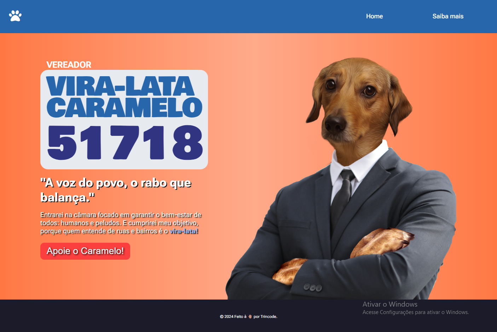
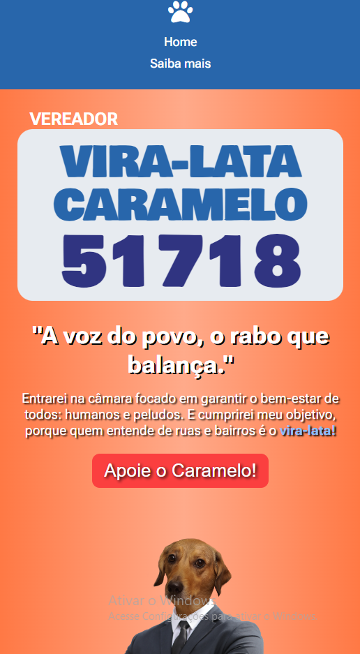

# Site Criativo – Campanha para Vereador: Vira-Lata Caramelo

Como estou colocando em prática os conceitos aprendidos com HTML e CSS, decidi transformar o aprendizado em algo divertido. Aproveitando o clima eleitoral, tive a ideia de desenvolver um site de página única para uma campanha eleitoral fictícia de um candidato carismático e (certamente) muito querido: o Vira-Lata Caramelo.🐕🐾 

## Visão geral

### ⚔️ O desafio

- Construir um site página única para a campanha eleitoral do candidato a vereador Vira-Lata Caramelo

### 🖼️ Aparência

### 🖇️ Links

- Acesso ao site: [https://trincode.github.io/site-campanha-viralata/](https://trincode.github.io/site-campanha-viralata/)
- Repositório github: [https://github.com/trincode/site-campanha-viralata](https://github.com/trincode/site-campanha-viralata)

## Meu processo

### Tecnologias

- HTML
- CSS

### Desafios e Conceitos aplicados

- Design Responsivo
- CSS Flexbox

### O que aprendi

Sem conceitos inéditos para mostrar.

### Desenvolvimento contínuo

Ainda pretendo adicionar um fundo com movimentação, e uma sessão de saiba mais sobre a história do candidato

### Recursos úteis

- [Fontawesome - Biblioteca de ícones](https://fontawesome.com/icons) - Usei essa biblioteca para adicionar a patinha como ícone (logo) do site;

## Autor

- LinkedIn - [Clayton Trindade](https://www.linkedin.com/in/clayton-trindade-93b925329/)

- Instagram - [@trincode - Clayton Trindade](https://www.instagram.com/trincode/)

## Agradecimentos

Meus agradecimentos aos @roberto-hofstetter e @cadudias, criadores do DevQuest, curso no qual aprendi a maioria dos conhecimentos utilizados aqui nesse projeto!